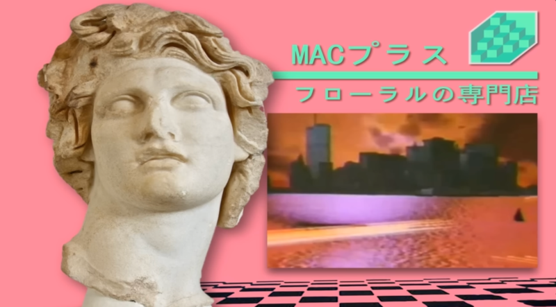

# Vapor—*is it vaporwave?*

A simple desktop application built with Jetpack Compose for Desktop, showcasing a motley collection of graphic techniques to evoke a sense of anemoia for a non-existent time or place. A healthy mix of human-hand-crafted organic Kotlin and curated LLM augmented code snippets.

## Introduction—*do you understand* 

Vapor is a desktop application built with Jetpack Compose for Desktop. The application is a sample demonstration of
various graphic techniques in Compose. It pulls nostalgic visual aesthetics from the [Vaporwave](https://en.wikipedia.org/wiki/Vaporwave)
meme/genre/music/aesthetic. It leans heavily on found elements and generated code and visuals. It
unashamedly pulls any visual technique to achieve a specific look. 

A-E-S-T-H-E-T-I-C

There will be 🏷️ ...
- [x] a blank page to [start](https://github.com/maiatoday/vapor/releases/tag/01-start)
- [x] a tastefully curated [palette](https://github.com/maiatoday/vapor/releases/tag/02-palette)
- [x] [quirky fonts](https://github.com/maiatoday/vapor/releases/tag/03-quirkyFonts)
- [x] a [triangle](https://github.com/maiatoday/vapor/releases/tag/04-triangle)
- [x] [vanishing floor](https://github.com/maiatoday/vapor/releases/tag/05-vanishingFloor) tiles
- [x] at least one [dolphin](https://github.com/maiatoday/vapor/releases/tag/06-dolphins)
- [x] a [marble statue](https://github.com/maiatoday/vapor/releases/tag/07-marble)
- [x] a [sunset](https://github.com/maiatoday/vapor/releases/tag/08-sunset)
- [x] [retro tech](https://github.com/maiatoday/vapor/releases/tag/09-cassette) pixelated if possible
- [x] [color shifts](https://github.com/maiatoday/vapor/releases/tag/10-matrixBlur) on images
- [x] [mesh pastel gradients](https://github.com/maiatoday/vapor/releases/tag/11-meshGradient)
- [x] neon svg scrawl, a minimum of one [palm tree](https://github.com/maiatoday/vapor/releases/tag/12-palmTree) 
- [x] a title, text slogans and Japanese [words](https://github.com/maiatoday/vapor/releases/tag/13-whatReloaded)
- [x] remixed [holofoil](https://github.com/maiatoday/vapor/releases/tag/14-holofoil)
- [x] glitches, more [glitches](https://github.com/maiatoday/vapor/releases/tag/15-glitch)
- [x] and finally, [all of the things](https://github.com/maiatoday/vapor/releases/tag/end)

## Getting Started—*make a move*

To run the application locally:

1. Clone the repository - no spoilers so checkout the start tag `git checkout 01-start`
2. Open the project in IntelliJ IDEA or another IDE that supports Kotlin
3. Run the `main` function in `Main.kt`

But better still try

## The hot reload experience—*time is running out*

1. Clone the repo if you haven't already
2. List the tags `git tag -n`
3. Switch to start `git checkout 01-start`
4. Run the project in hot reload mode with the command `./gradle runHot &`
5. Switch to alternative project states by jumping to tags `git checkout ??-xxx`
6. See the final state by jumping to the final tag `git checkout final`

For your own hot reload experience, copy the setup in this project [How-To](howToAddHotReload.md).

## The full 🎧 experience—*it's all in your head*

Explore the repo with a classic album on Bandcamp as the soundtrack

or this more mixed playlist

## Copyright, images, fonts and more—*I'm giving up on trying to sell you things that you ain't buying*

This project is under [MIT license](LicenseAgreement.md). Images were hand drawn or AI created and cropped, chopped and adjusted as needed.
Fonts are all available at [Google Fonts](https://fonts.google.com/selection)

# Nani?
- **何** (kanji) [[1]](https://www.reddit.com/r/translator/comments/z66rzc/english_japanese_i_need_conformation_on_how_to/) [[2]](https://www.thoughtco.com/nani-in-japanese-2028328)
- **なに** (hiragana) [[3]](https://www.reddit.com/r/translator/comments/z66rzc/english_japanese_i_need_conformation_on_how_to/)
- **ナニ** (katakana)

Indeed, nani?, *what?* or even *why?*. The deep research on Vaporwave with full references can be found in the [vaporwave report](docs/vaporwave.md) 

---

*some say no*

*you don't let go*

*We can go on*

*Cause I only have [eyes](liveTemplates.xml) for you*