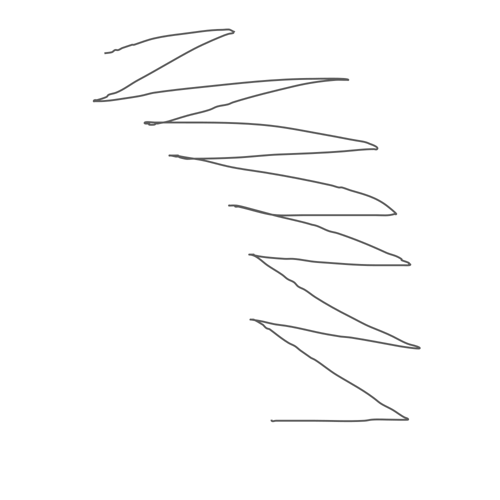
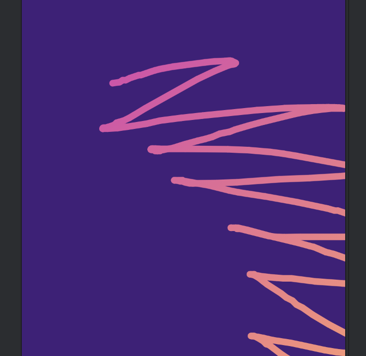

## Scribble drawing—path, matrix transform, flattened path

### How to get a path from svg



Create some scribbles in a package like inkscape or any drawing package that will let you save a svg. Don't make it complicated, draw a line with the pencil. Then open the svg with a text editor. You can [open](http://maiatoday.net/p/how-to-build-wrapped-2023-in-compose-animation/spikyscribble.svg) the svg displayed here and see what it looks like. You are looking for a line that starts with something like `<path style="fill:none;...`


Copy everything in the `d="...` section as a string and paste it into your code.


### Transforming the path with the matrix

The matrix transformation is [very similar](https://github.com/maiatoday/turbo-giggle/blob/2849314e0e2fb1e4670e500759c4fe7ff994a87b/app/src/main/java/net/maiatoday/turbogiggle/ScribblePath.kt#L164) to the RoundedPolygon one, but... we now need the Compose `Matrix` not the Android view one. Also, the bounds of the path are no longer -1,1 for both x and y. We can get the bounds of the path and use it to make a matrix to size the scribble to fit the view.

### Drawing the path

If we just draw the path as is, it will draw the whole path and not progressively draw it. There is a neat trick as shown in [this video at timestamp 31:36](https://youtu.be/2zVBnJ15C6M?si=GWK1N7W9waBtchKM&t=1884).

### ScribbleDraw the path with flattened lines

The clue is we split the whole path up into short sections, little lines, which we draw one after the other. The line of code where this happens is

```kotlin
val lines = path.asAndroidPath().flatten(0.5f)
```
The 0.5f parameter in the `flatten` call is the error that the flatten call allows; 0.5 is half a pixel. You can also see we need to convert again to an `AndroidPath` because the `flatten` method is only available on Android paths. We animate a progress variable so we can loop from say 0% to 10% and so on up to 100% and then start again. Then in the modifier `onDrawBehind` function lambda we loop through the `lines` and draw only those lines up to the progress variable. The animation is caused by only some of the path subsections being drawn and more and more of them being drawn as the progress increases.




```kotlin
@Composable
fun ScribblePath(path: Path, brush: Brush, modifier: Modifier = Modifier, strokeWidth: Dp = 8.dp) {
    val bounds = path.getBounds()
    val progress = remember {
        Animatable(0f)
    }
    LaunchedEffect(Unit) {
        progress.animateTo(
            1f,
            animationSpec = infiniteRepeatable(tween(3000, easing = LinearEasing))
        )
    }
    Spacer(modifier = modifier
        .padding(8.dp)
        .aspectRatio(bounds.width / bounds.height)
        .drawWithCache {
            val matrix = fromBoundsToComposeView(bounds, width = size.width, height = size.height)
            path.transform(matrix)
            val lines = path.asAndroidPath().flatten(0.5f)
            val pathMeasure = PathMeasure()
            pathMeasure.setPath(path, false)
            val totalLength = pathMeasure.length
            onDrawBehind {
                val currentLength = totalLength * progress.value
                lines.forEach { line ->
                    if (line.startFraction * totalLength < currentLength) {
                        drawLine(
                            brush = brush,
                            start = Offset(line.start.x, line.start.y),
                            end = Offset(line.end.x, line.end.y),
                            strokeWidth = strokeWidth.toPx(),
                            cap = StrokeCap.Round
                        )
                    }
                }
            }
        })
}

fun fromBoundsToComposeView(
    bounds: Rect = Rect(-1f, -1f, 1f, 1f),
    width: Float,
    height: Float
): Matrix {
    val originalWidth = bounds.right - bounds.left
    val originalHeight = bounds.bottom - bounds.top
    val scale = min(width / originalWidth, height / originalHeight)
    val newLeft = bounds.left - (width / scale - originalWidth) / 2
    val newTop = bounds.top - (height / scale - originalHeight) / 2
    val matrix = Matrix()
    matrix.translate(-newLeft, -newTop)
    matrix.scale(scale, scale)
    return matrix
}
```