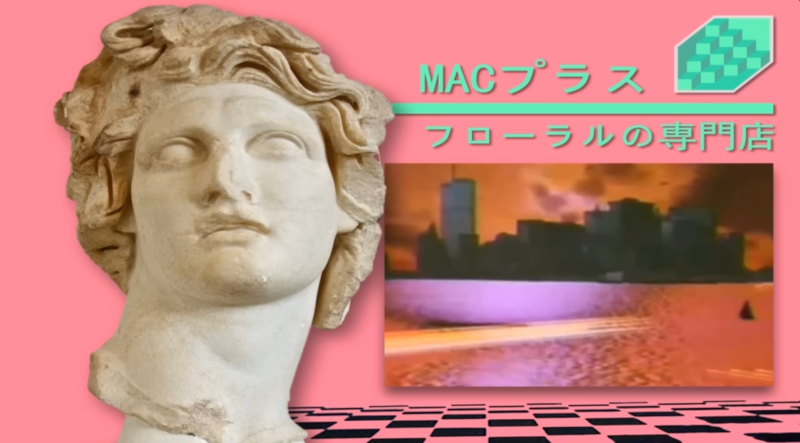

# Aesthetics




Vaporwave is characterised by a recognisable aesthetic. The Simpsons clip
titles [Sunday School](https://www.youtube.com/watch?v=rTfa-9aCTYg&list=PLISFEsGnceKCEmygK_n0QxHejHsBH8wsN&t=71s) shows
this.
More [inspiration](https://www.youtube.com/watch?v=3chbY7OSoBY&list=PLISFEsGnceKCEmygK_n0QxHejHsBH8wsN&index=9)

* Palm trees
* dolphins
* anime
* pastel
* glitch screens
* video recording pause play
* marble busts
* reference to mall shopping
* gradients
* neon
* Windows 95 computer iconography
* Receding checker board patterns of squares
* sunsets
* colour shifts
* triangles
* cyan, purple, magenta pink
* dreamy
* nostalgia
* collage
* surreal absurdist
* abandoned shopping mall of the 90s
* swimming pools
* tapes
* clipart
* font usage like slide techniques

# Fonts

[Rubik Broken Fax](https://fonts.google.com/specimen/Rubik+Broken+Fax?categoryFilters=Feeling:%2FExpressive%2FInnovative)
[Press Start 2P](https://fonts.google.com/specimen/Press+Start+2P?categoryFilters=Appearance:%2FTheme%2FTechno)

https://resourceboy.com/fonts/vaporwave/

# Sound

[vaporwave playlist](https://open.spotify.com/playlist/37i9dQZF1DWU4EQPjP9ZpS?si=356a10d0bc81494b)

[Blank Banshee 0](https://blankbanshee.bandcamp.com/album/blank-banshee-0)

[Macintosh Plus - Floral Shoppe](https://www.youtube.com/watch?v=cCq0P509UL4)

[2814](https://open.spotify.com/artist/2wBpW4bAGYVe0yJcBeCTyd?si=xgswhTRISLim4ShqdNVryA)

# History

[The curious history of vaporwave](https://www.youtube.com/watch?v=SP4b3sZxjc8)

https://pitchfork.com/thepitch/is-glitchcore-a-tiktok-aesthetic-a-new-microgenre-or-the-latest-iteration-of-glitch-art/

https://aesthetics.fandom.com/wiki/Vaporwave
Plunderphonics
Memory vague
nostalgia for a place you never knew

# Palette

```xml

<palette>
    <color name="Raisin black" hex="2E2A37" r="46" g="42" b="55"/>
    <color name="Violet (JTC)" hex="4C3045" r="76" g="48" b="69"/>
    <color name="Orchid pink" hex="E2B5C5" r="226" g="181" b="197"/>
    <color name="Cerulean" hex="3F7291" r="63" g="114" b="145"/>
    <color name="Royal purple" hex="724396" r="114" g="67" b="150"/>
    <color name="Mulberry" hex="DA4394" r="218" g="67" b="148"/>
    <color name="Buff" hex="D5A185" r="213" g="161" b="133"/>
    <color name="Glaucous" hex="6D84B8" r="109" g="132" b="184"/>
    <color name="Robin egg blue" hex="54BEC8" r="84" g="190" b="200"/>
    <color name="Rose Pompadour" hex="E0768D" r="224" g="118" b="141"/>
</palette>
```

```json
{
  "Raisin black": "2E2A37",
  "Violet (JTC)": "4C3045",
  "Orchid pink": "E2B5C5",
  "Cerulean": "3F7291",
  "Royal purple": "724396",
  "Mulberry": "DA4394",
  "Buff": "D5A185",
  "Glaucous": "6D84B8",
  "Robin egg blue": "54BEC8",
  "Rose Pompadour": "E0768D"
}
```
There is a way to get a path from an SVG and animate it. This blog extract, [ScribbleDraw](ScribbleDraw.md), describes it.

